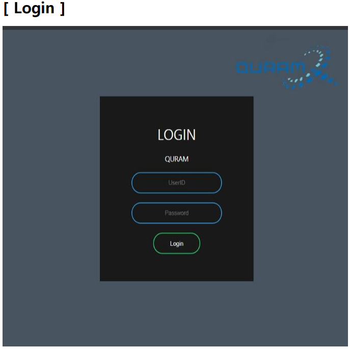
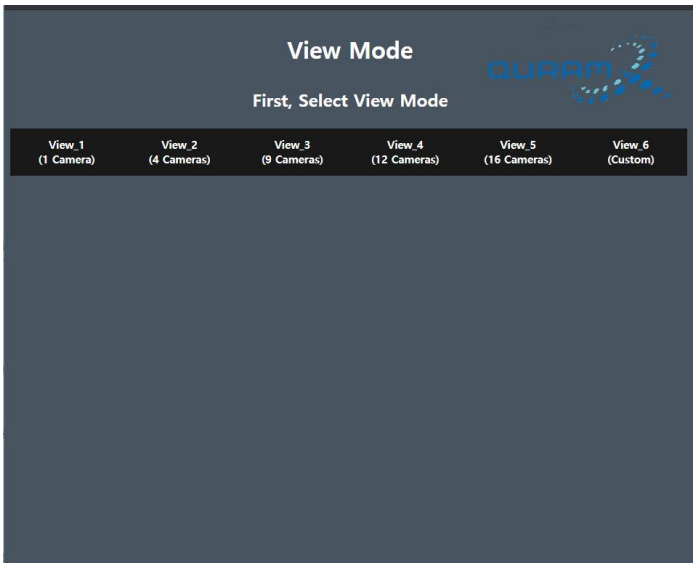
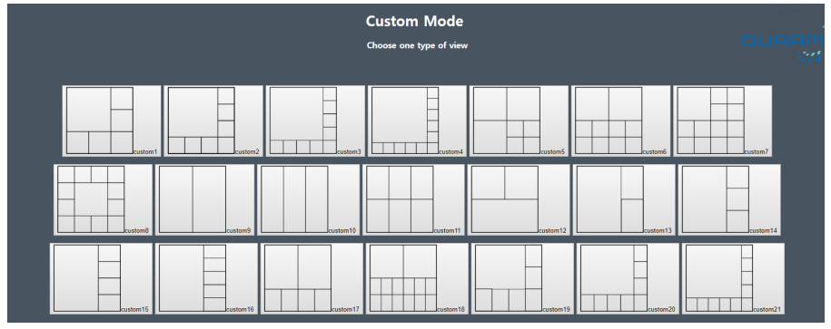
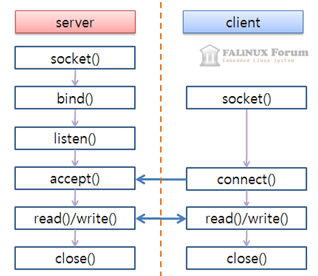

## View-Mode-Page  
### 💻큐램 학생 인턴 프로젝트💻
  |구분|내용|
|------|---|
  |프로젝트 | **View Mode 선택 페이지 만들기**   1. Login  2. View mode  3. TCP/IP communication  |
  |프로젝트 기간 | 2019 하계 방학 7월(약 한달) |

1. Login   
<figure>
    
</figure>

  ID와 PW를 입력한 후 초록색 Login 버튼을 누르면 submit 된다. 주어진 폼은 login_page.php에서 action되고, 로그인 페이지에서 입력되는 id와 pw는 userid, userpw에 값이 저장되어 login_page.php로 넘어간다.   로그인 화면은 로그인 후 다시 돌아갈 필요가 없다.  
  
    
  
  
3. TCP/IP Socket communication   
  연결을 대기하는 ip에서 이미 열어둔 포트넘버 5123사용. 아래 순서대로 socket 함수를 실행시킨다. socket이 제대로 생성되었고, bind 되었는지 확인하기 위해 echo를 이용한다.   
  함수 사용 순서 : socket_create() 함수를 이용해 TCP socket 생성 => bind() 함수를 이용해 소켓에 포트번호 연결
=> listen()함수를 이용해 클라이언트의 접속을 기다림 ( 한번에 5개의 클라이언트가 접속할 수 있도록 설정 )
=> accept()함수에서 클라이언트와 접속을 하고 그 이후 정보를 읽고 보낸다. => close() 함수로 연결을 끊는다.    

    
  사진 출처 : falinux forum
 

    
       $socket = socket_create(AF_INET,SOCK_STREAM,0); //TCP 통신용 소켓 생성
       if($socket == flase){
        echo "socket_create() 실패 이유 : " , sockdt_strerror(socket_last_error()), "\n";
       } else {
        echo "socket 생성 성공\n";
       }
       
       // IP주소와 포트넘버를 소켓에 결합
       socket_bind($socket,$address,$port) or die('Could not bind to address');
       socket_listen($socket,5);
       
       $accept = socket_accept($socket);
       if($accept == false){
        echo "socket_accept() 실패 이유 : ", socket_Atrerror(socket_last_error()), "\n";
       } else{
        echo "대기 성공적\n";
       }
       
       socket_wirte($accept,"연결완료\n");
       $input = socket_read($accept,1024) or die("could not read from socket\n"); // 소켓으로 부터 받은 request 정보
       socket_close($accept);
       
     
    
